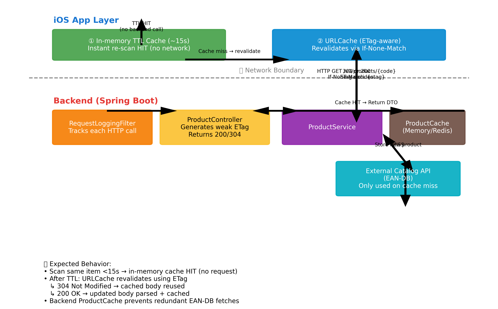

# 🛒 GoodBuy Backend

[](https://openjdk.org/projects/jdk/17/)
[](https://spring.io/projects/spring-boot)
[](https://docs.docker.com/compose/)
[](https://www.postgresql.org/)
[](https://flywaydb.org/)

**GoodBuy Backend** is a Spring Boot service that powers the GoodBuy iOS app with REST APIs for barcode-based product lookups and ingredient metadata.

---

## Table of Contents

- [Overview](#overview)
- [System Architecture Diagram](#system-architecture-diagram)
- [Project Structure](#project-structure)
- [Logging and Running](#logging-and-running)
- [Product API Endpoints Overview](#product-api-endpoints-overview)
- [Product Lookup Caching and ETag Revalidation](#product-lookup-caching-and-etag-revalidation)
- [Tech Stack](#tech-stack)
- [License](#license)

---

## Overview

- **Language:** Java 17
- **Framework:** Spring Boot 3.3.x
- **Database:** PostgreSQL 16 (Dockerized)
- **Migrations:** Flyway (auto-run on startup)
- **Docs:** OpenAPI/Swagger (`/v3/api-docs`)
- **Profiles:** `dev`, `prod`
- **Config:** `.env` + Docker secrets + Spring `application-*.properties`
- **Containers:** Docker Compose

---

## System Architecture Diagram

```text
┌─────────────────────────────────────────────────────────────────────┐
│                             iOS / Frontend                         │
│─────────────────────────────────────────────────────────────────────│
│ - Scans barcode (e.g. 0033200011408)                               │
│ - Calls backend: GET /v1/products/{code}                           │
└─────────────────────────────────────────────────────────────────────┘
                  │
                  ▼
┌─────────────────────────────────────────────────────────────────────┐
│                          goodbuy-api (Spring Boot)                 │
│─────────────────────────────────────────────────────────────────────│
│ REST Controllers                                                   │
│   • ProductController (/v1/products)                               │
│   • IngredientController (/api/ingredients)                        │
│                                                                     │
│ Services                                                           │
│   • ProductService → orchestrates catalog lookup                   │
│   • IngredientReadService → orchestrates ingredient DB reads       │
│                                                                     │
│ Shared Infrastructure                                              │
│   • RequestLoggingFilter, GlobalExceptionHandler                   │
│   • CORS & Swagger config                                          │
└─────────────────────────────────────────────────────────────────────┘
                  │
                  ▼
┌─────────────────────────────────────────────────────────────────────┐
│                        goodbuy-core (Domain Layer)                 │
│─────────────────────────────────────────────────────────────────────│
│ DTOs & Ports (Pure Java)                                           │
│   • ProductDetailDto, IngredientDto                                │
│   • ExternalCatalogClient, IngredientReadPort                      │
│   • BarcodeNormalizer, enums, utils                                │
│                                                                     │
│ No Spring, no HTTP, no DB — pure data + contracts                  │
└─────────────────────────────────────────────────────────────────────┘
          │                                 │
          ▼                                 ▼
┌─────────────────────────────────────────────────────────────────────┐
│             goodbuy-adapters-catalog (External Providers)          │
│─────────────────────────────────────────────────────────────────────│
│ • EanDbCatalogClient                                               │
│     - Calls https://ean-db.com/api/v2/product/{gtin}               │
│     - Maps JSON → ProductDetailDto                                 │
│ • EanSearchClient (optional)                                       │
│ • CatalogConfig / CatalogProperties                                │
│     - Chooses provider, configures timeouts & API keys             │
└─────────────────────────────────────────────────────────────────────┘
          │
          ▼
┌─────────────────────────────────────────────────────────────────────┐
│                    goodbuy-adapters-core + Postgres                │
│─────────────────────────────────────────────────────────────────────│
│ • CoreIngredientReadAdapter                                        │
│ • IngredientRepository (JPA)                                       │
│ • Tables: ingredients, aliases, hazards, tags, etc.                │
└─────────────────────────────────────────────────────────────────────┘
```

**End-to-end flow (simplified)**

- iOS → `ProductController` → `ProductService` → `EanDbCatalogClient` → EAN-DB API → `ProductDetailDto` → response to iOS
- iOS → `IngredientController` → `IngredientReadService` → `CoreIngredientReadAdapter` → `IngredientRepository` (Postgres) → `IngredientDto` → response to iOS

---

## Project Structure

```text
goodbuy-backend/
├─ pom.xml
├─ docker-compose.yml
│
├─ goodbuy-api/                          # REST API (Spring Boot)
│  └─ src/main/java/app/goodbuy/
│     ├─ GoodBuyBackendApplication.java
│     ├─ api/
│     │  ├─ RequestLoggingFilter.java
│     │  └─ GlobalExceptionHandler.java
│     ├─ config/
│     │  ├─ WebConfig.java
│     │  └─ AppProperties.java
│     ├─ products/
│     │  ├─ ProductController.java
│     │  └─ ProductService.java
│     └─ ingredients/
│        ├─ IngredientController.java
│        └─ IngredientReadService.java
│
├─ goodbuy-core/                         # Domain logic + DTOs + ports
│  └─ src/main/java/app/goodbuy/core/
│     ├─ products/
│     │  ├─ dto/ProductDetailDto.java
│     │  ├─ ports/ExternalCatalogClient.java
│     │  └─ util/BarcodeNormalizer.java
│     └─ ingredients/
│        ├─ dto/IngredientDto.java
│        └─ ports/IngredientReadPort.java
│
├─ goodbuy-adapters-catalog/             # External catalog integrations
│  └─ src/main/java/app/goodbuy/adapters/catalog/
│     ├─ CatalogConfig.java
│     ├─ CatalogProperties.java
│     ├─ eandb/EanDbCatalogClient.java
│     └─ eansearch/EanSearchClient.java
│
├─ goodbuy-adapters-core/                # Postgres adapter
│  └─ src/main/java/app/goodbuy/adapters/core/
│     ├─ CoreIngredientReadAdapter.java
│     ├─ repository/IngredientRepository.java
│     └─ entities/
│        ├─ IngredientEntity.java
│        ├─ AliasEntity.java
│        └─ HazardEntity.java
│
└─ goodbuy-migrations/                   # Flyway migrations
   └─ src/main/resources/db/migration/
      ├─ V1__ingredients_init.sql
      ├─ V2__aliases_table.sql
      └─ V3__hazards_table.sql
```

---

## Product Lookup Caching and ETag Revalidation

The GoodBuy platform implements a multi-layer caching strategy across both the iOS client and backend API.
This reduces redundant network calls, improves performance, and maintains synchronized product data.

### High-Level Overview

When a product is scanned:

```
iOS Memory Cache  →  iOS URLCache (ETag)  →  Backend ProductCache  →  External EAN-DB
       ↓                     ↓                        ↓
  Immediate hit         304 Not Modified        Remote fetch if cache miss
```



---

### iOS Client Implementation

**Files:** `GoodBuyBackendProvider.swift`, `ResultViewModel.swift`

#### In-Memory TTL Cache (~15 seconds)
- Rapid re-scans of the same product (within ~15s) are served from memory.
- No network call is made, providing a zero-latency experience.

#### System URLCache with ETag Revalidation
- Relies on backend `ETag` headers for conditional requests.
- Uses `If-None-Match` for revalidation.
- `304 Not Modified` → reuse cached body.
- `200 OK` → update cache automatically.

---

### Backend Implementation

**File:** `ProductController.java`

#### ETag Support
- Each `/v1/products/{code}` response includes a weak ETag (`W/"sha256…"`) derived from the JSON body.
- If the client provides `If-None-Match`, a matching hash returns `304 Not Modified`.

#### Cache-Control Policy

```http
Cache-Control: public, max-age=300, stale-while-revalidate=60
```

- Cached responses remain valid for 5 minutes and support background revalidation.
- Reduces redundant API calls while maintaining up-to-date content.

#### Backend Product Cache
- The backend caches product DTOs in memory (or Redis).
- Cache hits are served instantly; misses fetch from EAN-DB and are stored for reuse.

---

### Benefits

- **Improved performance:** Same-product re-scans typically <50 ms
- **Reduced load:** Requests often resolve via cache or `304`
- **Smart freshness:** Cached data auto-refreshes via ETags
- **Consistency:** Client and server remain synchronized efficiently

---

## Tech Stack

| Layer            | Technology                     |
|------------------|--------------------------------|
| Language         | Java 17                        |
| Framework        | Spring Boot 3.3.x              |
| Database         | PostgreSQL 16                  |
| Migrations       | Flyway                         |
| Containerization | Docker / Docker Compose        |
| API Docs         | OpenAPI / Swagger              |
| Logging          | Structured logs + Request IDs  |
| Architecture     | Modular Hexagonal              |

---

## License

© 2025 GoodBuy. All rights reserved.
